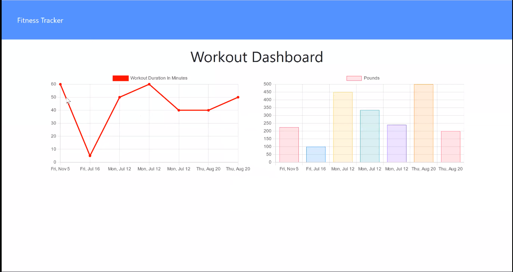

## <Fitness-Tracker>

## Table of Contents

  - [Description](#description)
  - [Installation](#installation)
  - [Usage](#usage)
  - [Credits](#credits)
  - [GitHub](#github)
  - [Features](#features)
  

## Description

This application has been built collaboratively within a context of a Pandemic. During the pandemic, many of us saw ourselves limited to indoor activities at our homes, which created the challenge of how to spend our time and entertain with less social activity. Also, at present, COVID-19 cases have decreased and restrictions are being lifted. This means businesses are reopening and social gatherings are becoming more common.

As demand for social activities increase, there is the opportunity to help people find or choose what they want to do and reconnect with their friends, families and passions.

1. This web application will allow users to first choose if they want to stay inside or if they want to go outside. 
2. Once chosen, the application will display a set of activity cards and present the user with preference buttons to filter activites.
3. Once filtered, the list of activities will be narrowed down. From this short list the user will be able to select an activity by cliking on the card.
4. Once an activity is selected, the user will be presented with more details about that specific activity.
5. If logged in, the user will be allowed to comment on the specific activity comments section and to see what other users have commented.

## Installation

No installation is needed. This application is run in a live webpage in heroku app. To visit the deployed page, please go to the #usage section of this README.

## Usage

To use this application, go to the deployed webpage by followig this link: [Visit the deployed page](https://fitness-tracker-apj.herokuapp.com/?id=618d6d09e1bbb1001665fd93)

Once in the landing page, click on 'New Workout' to be directed to the type of workout form.

Select the resistance type of workokut, and you will be directed to the resistance exercise form, as shown below.

Or select the cardio type of workokut, and you will be directed to the cardio exercise form, as shown below.

After creating a new workout and/or adding exercises to an existent workout, you will be able to go to the 'Dashboard' page by clicking on the 'Dasboard' button at the upper left corner of the page, to the right of the 'Fitness Tracker' button. This will direct you to the dashboars, where you will be able to see the statistics of your previous workouts like so:

## Credits

Third-party assets:
- [Bootstrap](https://getbootstrap.com/)
- [npm](https://www.npmjs.com/)
- [ExpressJs](https://expressjs.com/)
- [MongoDB](https://www.mongodb.com/)
- [MongoDB Atlas](https://cloud.mongodb.com)
- [Robo 3T](https://robomongo.org/)
- [Heroku](https://www.heroku.com/nodejs) 

Reference material:
- [w3schools](https://www.w3schools.com/)
- [StackOverflow](https://stackoverflow.com/)
- [Mozilla Developer Network](https://developer.mozilla.org/en-US/)

## GitHub

If you want to know more details, feel free to [visit the repo](https://github.com/aj-pena/Fitness-Tracker.git)

## Features

FrontEnd:
- Bootstrap grid, cards, forms and dropdowns
- npm -chart.js

BackEnd:
- Heroku
- MongoDB 
- Model View Controller framework
- Node.js
  
  
